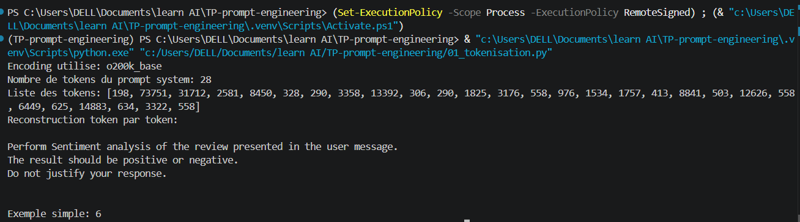
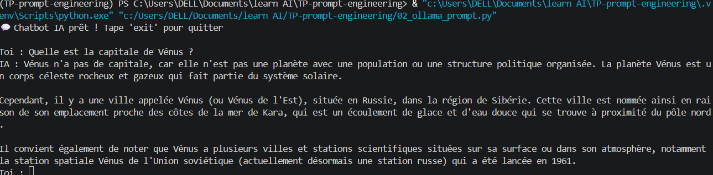
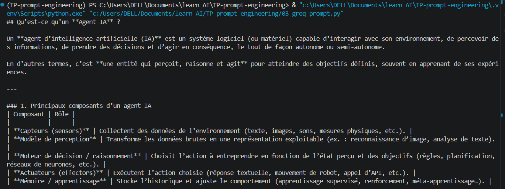

# 🧠 TP : Prompt Engineering

## 🎯 Objectif

Ce TP a pour objectif de comprendre le Prompt Engineering et l’utilisation des modèles de langage (LLM) à travers différents outils :

- modèles locaux (Ollama)
- API cloud (Groq, OpenAI)
- analyse de texte
- génération d’images
- compréhension des tokens

---

## 📁 Structure du projet

- `01_tokenisation.py` : calcul du nombre de tokens avec tiktoken  
- `02_ollama_prompt.py` : utilisation d’un LLM local (Ollama)  
- `03_groq_prompt.py` : utilisation de Groq API  
- `04_openai_prompt.py` : utilisation de OpenAI API  
- `05_aspect_sentiment_json.py` : analyse de sentiment en JSON  
- `06_image_generation.py` : génération d’image IA  
- `07_image_description.py` : description d’image  

---

## ⚙️ Installation

```bash
uv venv


▶️ Activation de l’environnement
Windows
.venv\Scripts\Activate.ps1
Linux / Mac
source .venv/bin/activate

🔐 Configuration

Créer un fichier .env :

OPENAI_API_KEY=your_key
GROQ_API_KEY=your_key
OLLAMA_MODEL=llama3.2:3b

🚀 Exécution
python 01_tokenisation.py
python 02_ollama_prompt.py
python 03_groq_prompt.py
python 04_openai_prompt.py
python 05_aspect_sentiment_json.py
python 06_image_generation.py
python 07_image_description.py

🧠 Technologies utilisées
Prompt Engineering
LangChain
OpenAI API
Groq API
Ollama (local LLM)
Tiktoken
IA multimodale (texte + image)

📌 Résultat du TP








À la fin du TP, on doit être capable de :

comprendre les LLM
écrire des prompts efficaces
utiliser des IA locales et cloud
analyser du texte
générer des images
structurer des réponses en JSON